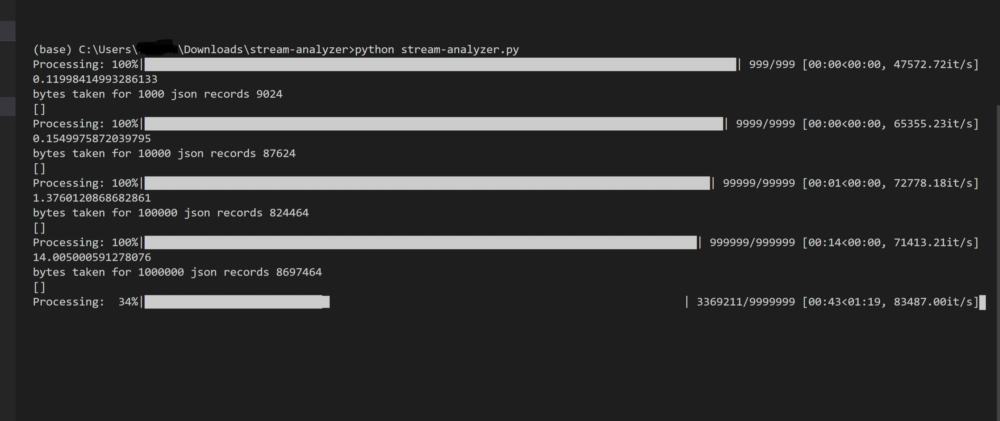
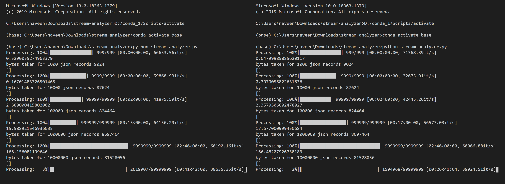

# Streaming-Data-Analyser
This repository code file aims to generate random data, which can be assumed of type streaming in the context of big data. 
if you make a connection to a Kinesis Data Stream it becomes Streaming Source.

> Here are the below Experiments You can perform with this code. 

- Task 1: Run this Program in Multiple consoles and check the resource monitor of your computer, And boom feel the Eureka.
- Task 2: Run this Program in the console and check the time taken to generate the data for each upper bound. So that you get a vivid picture of it.  
- Task 3: Run this Program Multiple times and Bench mark the results and analyse how much time will it take to generate 1 Billion Records. 

 Single Console Output:
 
 
 
 Multiple Console Output:
 

